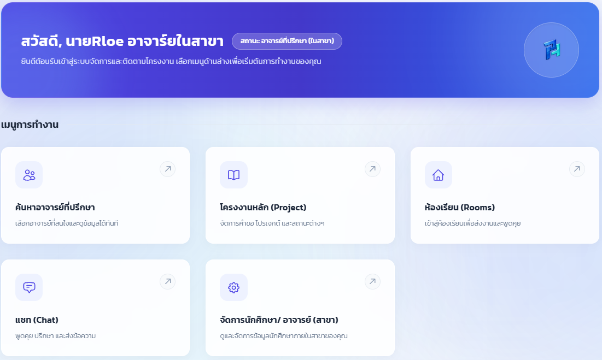
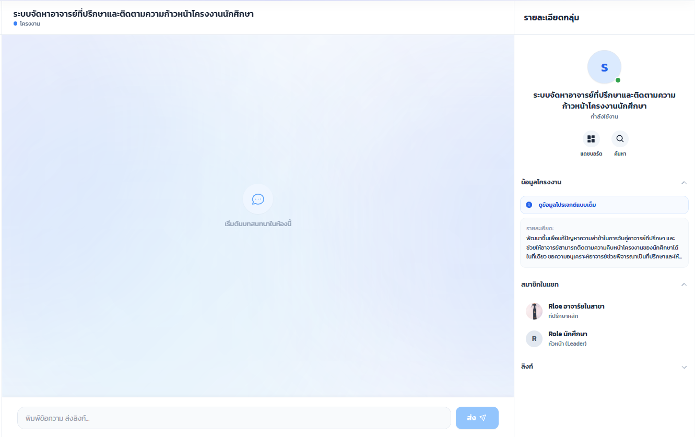
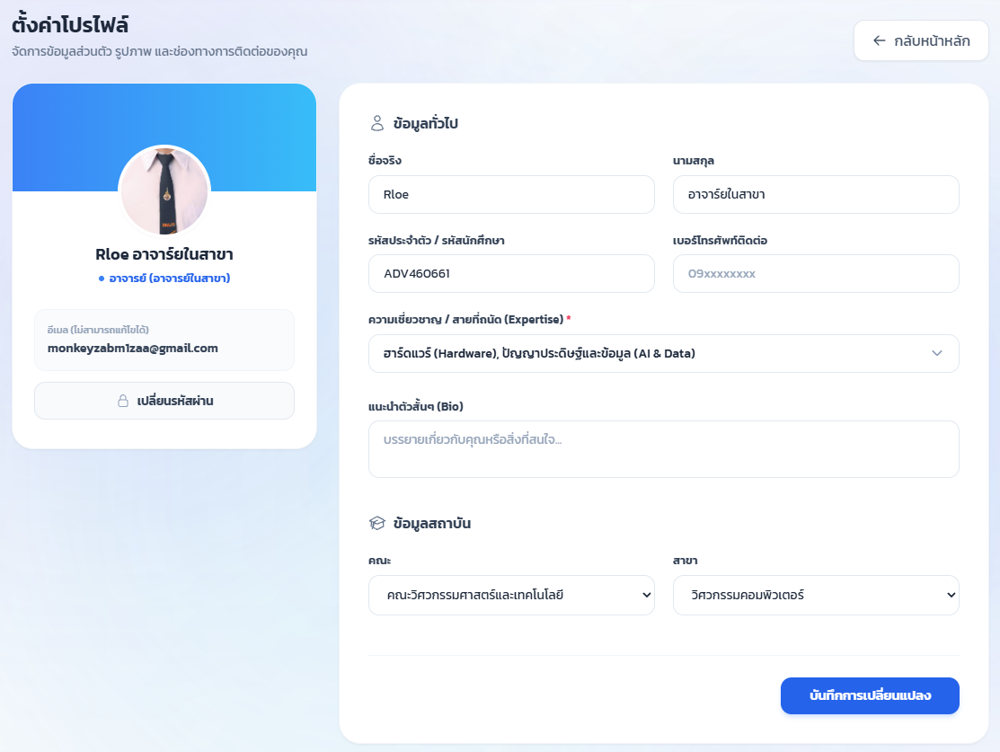
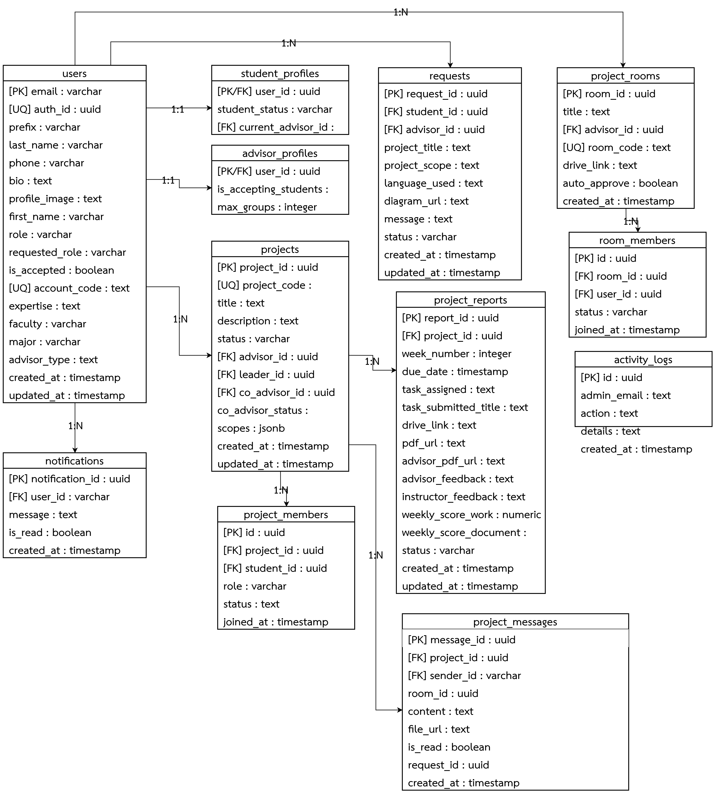
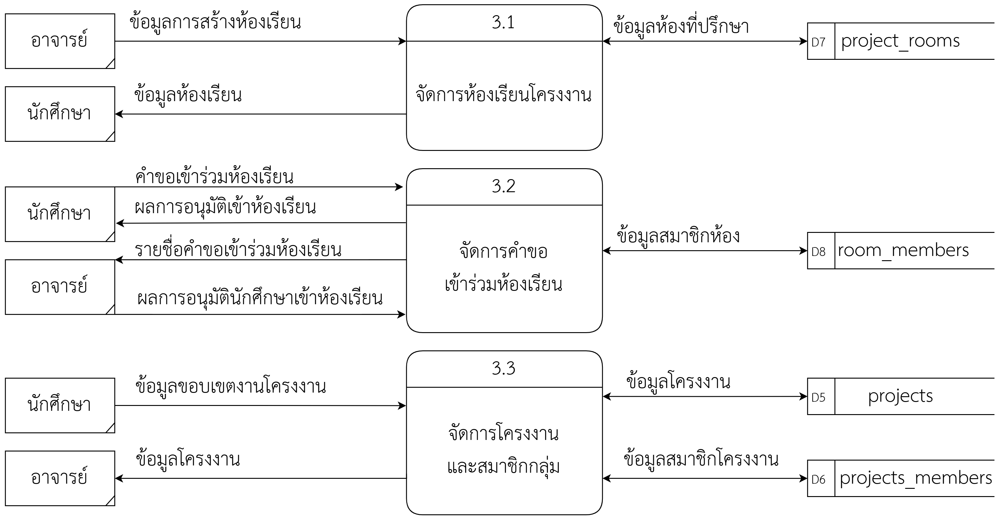
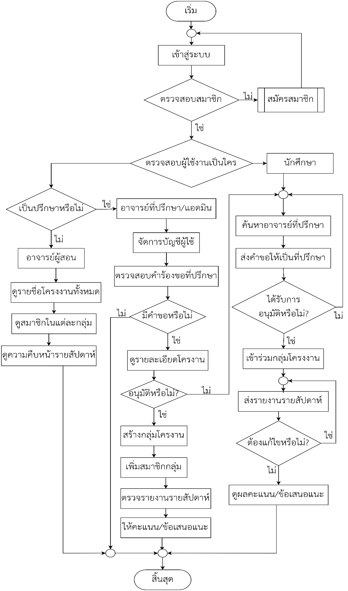

<div align="center">
  
  <h1>ADSYS RMUTI</h1>
  <h3>ระบบจัดหาอาจารย์ที่ปรึกษาและติดตามความก้าวหน้าโครงงานนักศึกษา</h3>
  <p>Advisor Placement and Project Tracking System for Rajamangala University of Technology Isan</p>

  <p align="center">
    
    &nbsp;
    
    &nbsp;
    
    &nbsp;
    
    &nbsp;
    
    &nbsp;
    
    &nbsp;
    
    &nbsp;
    
  </p>
</div>

<br>

---

## ภาพรวมโครงงาน (Project Overview)

**ADSYS RMUTI** คือระบบเว็บแอปพลิเคชันแบบครบวงจร (Full-Stack Web Application) ที่พัฒนาขึ้นเพื่อแก้ไขปัญหาความล่าช้าและความซ้ำซ้อนในกระบวนการจัดหาอาจารย์ที่ปรึกษาและการติดตามความก้าวหน้าการทำโครงงานของนักศึกษา โดยระบบทำหน้าที่เป็นศูนย์กลางดิจิทัลในการจับคู่อาจารย์ตามความเชี่ยวชาญ ยื่นคำร้องขอที่ปรึกษา ส่งงานรายงานความก้าวหน้ารายสัปดาห์ การให้ข้อเสนอแนะและประเมินผลคะแนน ตลอดจนการสื่อสารแบบทันท่วงที (Real-time Communication) ภายใต้สถาปัตยกรรมที่ปลอดภัยและเสถียร

---

## ภาพตัวอย่างหน้าจอการทำงานจริง (Production UI Showcase)

### 1. หน้ากระดานหลักและการนำทาง (Dashboard & Navigation)
อินเทอร์เฟซหลักสำหรับการเข้าถึงฟังก์ชันต่างๆ ของระบบ ออกแบบด้วย Tailwind CSS เพื่อความเรียบง่าย สะอาดตา และรองรับการแสดงผลแบบ Responsive

<p align="center">
  
</p>

---

### 2. ห้องส่งงานและการสนทนารายโครงงาน (Project Chat & Collaboration Room)
ระบบการทำงานร่วมกันระหว่างนักศึกษาและอาจารย์ที่ปรึกษา รองรับการส่งข้อความ ลิงก์งาน และไฟล์รายงานความก้าวหน้า พร้อมระบบแสดงสถานะแบบเรียลไทม์

<p align="center">
  
</p>

---

### 3. การจัดการข้อมูลและการตั้งค่าโปรไฟล์ (Profile & Expertise Management)
ระบบจัดการข้อมูลส่วนตัว ความเชี่ยวชาญเฉพาะด้านของอาจารย์ที่ปรึกษา และการกำหนดจำนวนกลุ่มโครงงานที่สามารถรองรับได้

<p align="center">
  
</p>

---

## สถาปัตยกรรมระบบและฐานข้อมูล (Architecture & System Diagrams)

### 1. แผนผังความสัมพันธ์ข้อมูล (Entity-Relationship Diagram: ERD)
สถาปัตยกรรมฐานข้อมูลเชิงสัมพันธ์ (Relational Database) บน PostgreSQL ควบคุมการเข้าถึงด้วย Row Level Security (RLS) เพื่อแยกสิทธิ์ความปลอดภัยในระดับแถวข้อมูล

<p align="center">
  
</p>

---

### 2. แผนภาพกระแสข้อมูลระดับ 1 (Data Flow Diagram: DFD Level 1)
การไหลของข้อมูลระหว่าง Entity หลัก ได้แก่ นักศึกษา อาจารย์ที่ปรึกษา อาจารย์ประจำวิชา และผู้ดูแลระบบ

<p align="center">
  
</p>

---

### 3. แผนผังการทำงานของอาจารย์ที่ปรึกษา (Advisor Workflow Flowchart)

<p align="center">
  
</p>

---

## ฟังก์ชันการทำงานแยกตามสิทธิ์ผู้ใช้ (Role-Based Access Control: RBAC)

| บทบาท (Role) | ฟังก์ชันและความสามารถของระบบ |
| :--- | :--- |
| **ผู้ดูแลระบบ (Admin)** | จัดการบัญชีผู้ใช้งาน, อนุมัติสิทธิ์อาจารย์/นักศึกษา, จัดการข้อมูลสาขาวิชา, เรียกดูบันทึกประวัติการใช้งาน (Audit Logs), ตรวจสอบสถิติภาพรวมโครงงานทั้งคณะ |
| **อาจารย์ที่ปรึกษา (Advisor)** | ตั้งค่าสาขาความเชี่ยวชาญ, กำหนดโควตารับกลุ่มโครงงาน, พิจารณาอนุมัติ/ปฏิเสธคำร้องขอเป็นที่ปรึกษา, ตรวจและให้คะแนนรายงานความก้าวหน้ารายสัปดาห์, สนทนาและให้คำปรึกษาผ่านห้องโครงงาน |
| **อาจารย์ประจำวิชา (Instructor)** | กำหนดกำหนดการส่งงานประจำภาคการศึกษา (Deadlines), ตรวจสอบสถานะการจับคู่ที่ปรึกษาของนักศึกษาทุกคน, เรียกดูรายงานคะแนนรวมรายวิชา, ส่งออกรายงานผลการดำเนินงาน |
| **นักศึกษา (Student)** | ค้นหาอาจารย์ที่ปรึกษาตามความเชี่ยวชาญ, สร้างคำขอและส่งขอบเขตโครงงาน, สร้างกลุ่มโครงงาน, ส่งรายงานความก้าวหน้ารายสัปดาห์, ตรวจสอบคะแนนและข้อเสนอแนะ, แชทปรึกษาอาจารย์ในห้องโครงงาน |

---

## สแตกเทคโนโลยี (Technology Stack)

### Frontend
* **Core:** `React 19` (Single Page Application Architecture)
* **Build Tool:** `Vite` (Fast HMR & Optimized Bundling)
* **Styling:** `Tailwind CSS`, `PostCSS`, `Autoprefixer`
* **Routing:** `React Router 7`
* **Icons & Components:** `Lucide React`, `SweetAlert2`, `React Easy Crop`

### Backend & API
* **Runtime:** `Node.js` (v24.x)
* **Framework:** `Express.js` (RESTful API Architecture)
* **Authentication:** JSON Web Tokens (`jsonwebtoken`)
* **Scheduled Tasks:** `node-cron`
* **Security & Middleware:** `cors`, `dotenv`, Role-Based Access Middleware

### Database & Cloud Services
* **Database Engine:** `Supabase` (PostgreSQL Database Engine)
* **Security Policy:** PostgreSQL Row Level Security (RLS)
* **Hosting / Deployment:** `Vercel` (Frontend) & Cloud Infrastructure

---

## โครงสร้างโฟลเดอร์โปรเจกต์ (Repository Structure)

```text
adsysrmuti/
├── backend/                    # Node.js & Express API Server
│   ├── config/                 # Supabase & Database configuration
│   ├── controllers/            # Request handlers & Business logic
│   ├── middleware/             # Auth & Role verification middleware
│   ├── routes/                 # Express API routes
│   └── server.js               # API Server entry point
├── frontend/                   # React 19 Frontend Application
│   ├── public/                 # Static assets (PJ.png, icons, favicon)
│   ├── src/
│   │   ├── components/         # Reusable UI components
│   │   ├── contexts/           # React Context providers (Auth, Theme)
│   │   ├── lib/                # Supabase client & utilities
│   │   ├── pages/              # Application views & dashboards
│   │   ├── styles/             # Global CSS & Tailwind configuration
│   │   ├── App.jsx             # Root routing & layout
│   │   └── main.jsx            # React DOM mounting
│   ├── tailwind.config.js
│   └── vite.config.js
├── docs/                       # Project documentation & diagrams
│   └── images/                 # Real UI screenshots, ERD, and DFD
└── README.md
```

---

## วิธีการติดตั้งและรันในเครื่อง (Local Development Setup)

### 1. Clone Repository
```bash
git clone https://github.com/Akkaradet-Wong/adsysrmuti.git
cd adsysrmuti
```

### 2. ติดตั้งและเริ่มทำงานฝั่ง Backend
```bash
cd backend
npm install
# สร้างไฟล์ .env สำหรับกำหนด PORT, SUPABASE_URL, SUPABASE_KEY, JWT_SECRET
npm start
```

### 3. ติดตั้งและเริ่มทำงานฝั่ง Frontend
```bash
cd ../frontend
npm install
# สร้างไฟล์ .env สำหรับกำหนด VITE_SUPABASE_URL และ VITE_SUPABASE_ANON_KEY
npm run dev
```

---

## ผู้จัดทำโครงงาน (Project Authors)

* **นายอัครเดช วงศ์บำหราบ (Akkaradet Wongbamrap)** — Frontend & System Architecture ([@Akkaradet-Wong](https://github.com/Akkaradet-Wong))
* **นายณัฐกฤต คงยิ่ง (Nattagrit Kongying)** — Backend & Database Engineering ([@nattagrit](https://github.com/nattagrit))

*โครงงานปริญญานิพนธ์ สาขาวิศวกรรมคอมพิวเตอร์ คณะวิศวกรรมศาสตร์และเทคโนโลยี มหาวิทยาลัยเทคโนโลยีราชมงคลอีสาน*
